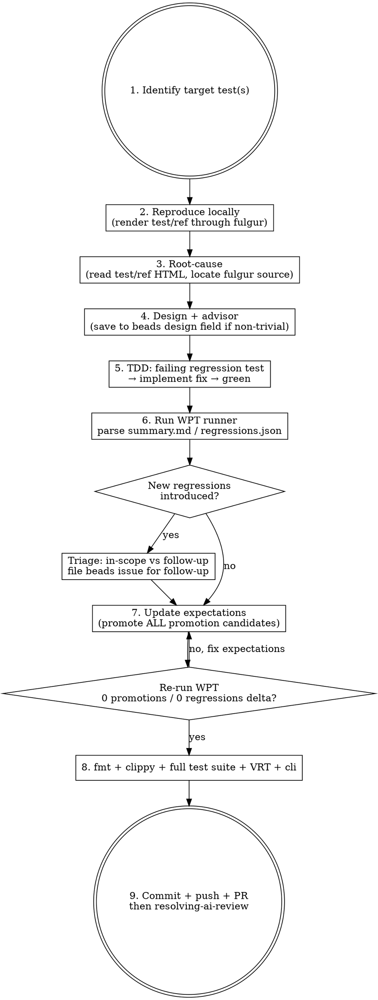

# wpt-promote

Repeatable workflow for taking one (or a small set) of failing WPT tests from
FAIL to PASS in `crates/fulgur-wpt/expectations/`. Captures the path that
worked for `fulgur-aijf` (PR #260, `page-background-002/003` + `fixedpos-001`):
reproduce → root-cause → fix with TDD → verify net WPT delta → promote
expectations + downgrade unavoidable regressions → ship.

**Announce at start:** "Using wpt-promote to flip <test name> from FAIL to PASS."

## Inputs

The agent enters with one of:

- **A beads issue** (e.g. `fulgur-aijf`) whose acceptance criteria names
  specific WPT tests. Read the issue first via `bd show <id>` — the
  description usually contains the test path and current FAIL reason.
- **A direct test name** (e.g. `css/css-page/page-background-002-print.html`)
  passed in conversation.

If neither is present, ask the user which test to target.

## Workflow



## Step 1 — Identify the target test(s)

Read the beads issue (if any) and extract:

- The test path (e.g. `css/css-page/page-background-002-print.html`)
- The expected `ref` (usually `<name>-print-ref.html` next to it)
- The current FAIL reason (page count mismatch / pixel diff / etc.)

If multiple WPT tests share the same root cause, **list them all** —
expectations promote together when the underlying fix lands.

## Step 2 — Reproduce locally

Render both files through fulgur and confirm the failure mode:

```bash
# Render test
cargo run --bin fulgur --release -- \
  render target/wpt/css/<phase>/<name>-print.html -o /tmp/test.pdf
pdfinfo /tmp/test.pdf | grep Pages

# Render ref
cargo run --bin fulgur --release -- \
  render target/wpt/css/<phase>/<name>-print-ref.html -o /tmp/ref.pdf
pdfinfo /tmp/ref.pdf | grep Pages
```

If page counts differ, the failure is "page count mismatch". If they match
but pixels differ, it's a visual regression — use the WPT runner's diff
images under `target/wpt-report/<phase>/diffs/<name>/` to inspect.

**WPT data path**: tests live under `target/wpt/`. If missing, the WPT
runner reports "skip" — symlink from main worktree
(`ln -s /home/ubuntu/fulgur/target/wpt .worktrees/<name>/target/wpt`)
or run `scripts/wpt/fetch.sh` from a worktree where it exists.

## Step 3 — Root-cause

Open both HTML files. Identify which CSS feature/property is the test's
focus — usually visible in `link rel="help"` or the inline comment.

Locate the fulgur source for that feature:

```bash
# Find the relevant convert path
grep -rn "<feature>" crates/fulgur/src/convert/ | head
```

For non-trivial root causes, **call `advisor()` before committing to a
fix approach** — the advisor sees the conversation and can flag missing
constraints (height-fold, paint-order, OOF-aware split logic, etc. —
this is exactly how PR #260's `out_of_flow` flag was identified).

## Step 4 — Design

For substantial work (anything beyond a one-line fix), save the design
to the beads issue's `design` field:

```bash
bd update <issue-id> --design="$(cat /tmp/design.md)"
```

Lead the design with the **two-piece rule** when applicable: many "promote
this WPT" fixes split into (a) a structural flag/state change in
`pageable.rs` and (b) a hoisting/conversion change in `convert/`.
PR #260's `out_of_flow` flag + `build_absolute_non_pseudo_children` was
exactly this shape.

## Step 5 — TDD

Create a worktree (`superpowers:using-git-worktrees`) and:

1. **Write a failing regression test first**, in
   `crates/fulgur/tests/<feature>_test.rs`. Use the existing `page_count`
   helper (`tests/page_break_wiring.rs:11`) for byte-count tests, or
   `Engine::build_pageable_for_testing_no_gcpm()` for tree-inspection
   tests when the oracle needs to detect dropped/misplaced nodes
   (`!pdf.is_empty()` is **never** a sufficient oracle — krilla always
   serialises a complete PDF).
2. **Implement** the fix.
3. Verify the regression test goes green.
4. Run the full suite locally:

   ```bash
   cargo test -p fulgur --lib --quiet | tail -3
   cargo test -p fulgur 2>&1 | grep "test result:"
   ```

If you added pure helpers in `pageable.rs`, also add unit tests in
`#[cfg(test)] mod tests` per CLAUDE.md's "Coverage scope" rule —
codecov's patch coverage doesn't count VRT-only paths.

## Step 6 — Run the WPT runner

```bash
ln -sf /home/ubuntu/fulgur/target/wpt target/wpt  # if not present
FULGUR_WPT_REQUIRED=1 cargo test -p fulgur-wpt --test wpt_<phase> --release \
  -- --nocapture 2>&1 | grep -E "regressions=|promotions=|<phase> report"
```

Phases: `wpt_css_page`, `wpt_lists`, `wpt_smoke`. The phase name maps to
`target/wpt/css/<subdir>/`.

After it runs, parse the report:

```bash
cat target/wpt-report/<phase>/summary.md | grep -A30 "Promotion candidates"
cat target/wpt-report/<phase>/regressions.json | python3 -c "
import json, sys
d = json.load(sys.stdin)
for r in d:
    print(r['test'].split('/')[-1].replace('-print.html', ''), '→', r['message'])"
```

**Critical: distinguish your fix's deltas from pre-existing flakiness.** Run
the same WPT phase against `main` and compare regression/promotion lists.
The numbers that matter for your fix:

- *Net new promotions*: tests now PASS that were FAIL on main → these are
  your fix's wins.
- *Net new regressions*: tests now FAIL that were PASS on main → these are
  your fix's costs.

Pre-existing failures (same regressions on main and your branch) are
**not your responsibility** in this PR.

## Step 7 — Update expectations

Edit `crates/fulgur-wpt/expectations/<phase>.txt`:

- **Net new promotions**: flip `FAIL → PASS` and remove the comment.
  *Promote ALL of them*, not just the target — leaving promotion
  candidates as `FAIL` is "leaking correctness" and the next reviewer
  will flag it.
- **Net new regressions**:
  1. Open a follow-up beads issue (`bd create --type=bug --priority=3`)
     describing the regression, the test that failed, and a direction
     for the deeper fix.
  2. Flip the expectation comment to reference the new issue:

     ```text
     FAIL  css/...  # fulgur-XXXX: <one-line reason>
     ```

- **Pre-existing regressions** (same on main): leave untouched.

Then **re-run the WPT runner** and confirm:

```text
regressions=<same number as main>
promotions=0
```

`promotions=0` means expectations are in sync — no candidates left
unflipped.

## Step 8 — Lint + final verification

```bash
cargo fmt
cargo fmt --check         # must be clean
cargo clippy --all-targets 2>&1 | grep "^warning:"  # must be empty
cargo test -p fulgur 2>&1 | grep -c "FAILED"        # must be 0
cargo test -p fulgur-vrt --release 2>&1 | grep -c "FAILED"  # must be 0
cargo test -p fulgur-cli 2>&1 | grep -c "FAILED"    # must be 0
```

`cargo fmt --check` is CI-enforced (CLAUDE.md). VRT goldens may need
regenerating with `FONTCONFIG_FILE=$PWD/examples/.fontconfig/fonts.conf
FULGUR_VRT_UPDATE=1 cargo test -p fulgur-vrt` if rendering changed
intentionally — but treat any unintended VRT shift as a stop signal,
not a regenerate-and-go.

## Step 9 — Commit, push, PR

Per project memory:

- **Commit message**: English. Lead with `fix(<area>):` or `feat(<area>):`
  describing the structural change. Body explains *why* and lists the
  WPT delta concisely. Reference the beads issue ID at the bottom (e.g.
  `fulgur-aijf`).
- **PR title**: English (under 70 chars).
- **PR body**: Japanese. Include "概要", "設計", "検証", "WPT delta" with
  a small table for promotions/regressions.

Push and create the PR via `gh pr create`. Do **not** push to `main`.

## Step 10 — AI review iteration

After the PR is up, hand off to **`resolving-ai-review`** for coderabbit
/ Devin Review iteration. That skill polls for re-reviews, triages
findings, and cycles fix → push → poll until coderabbit no longer
requests changes. Don't manually re-poll.

## Common pitfalls

| Pitfall | Why it happens | How to avoid |
|---|---|---|
| Test passes but oracle is too weak | `assert!(!pdf.is_empty())` always holds because krilla serialises a complete PDF on every render | For "X is in the tree" oracles, walk the Pageable tree via `Engine::build_pageable_for_testing_no_gcpm` and assert structural properties (size, `out_of_flow`, etc.) |
| "Why did test=N ref=M when same engine renders both?" | The `<test>` and `<ref>` files use different CSS features. Engine bugs may surface only in one path. | Always render BOTH through fulgur and inspect each independently. |
| Flipped one promotion, missed others | Single-test focus | After re-running WPT, the report's `promotions=0` line is the gate. Anything > 0 means an unflipped candidate. |
| New regressions look like pre-existing flakiness | Both report lines say `FAIL ... declared=PASS` | Run the same WPT phase on `main` to baseline, then diff the regression lists. Net-new regressions are yours. |
| `display:contents` zero-size wrapper test | Blitz drops abs descendants of contents-display wrappers entirely (separate issue). Tests using it as the zero-size container won't exercise the flatten path you're guarding. | Use a real `width:0; height:0; overflow:visible` `<div>`. |
| Worktree sparse-checkout blocks `git add` | `git worktree add` inherits a `.beads/`-only sparse-checkout pattern | Right after creating the worktree: `git -C <path> sparse-checkout disable`. Documented in CLAUDE.md. |
| Forgot to symlink `target/wpt` in worktree | WPT runner reports "skip: ... missing" | `ln -s /home/ubuntu/fulgur/target/wpt .worktrees/<name>/target/wpt` once per worktree. |
| Tried to push without authorization | Auto mode ≠ push permission | `git push` only after explicit user "yes" / "push it" / "make a PR". CLAUDE.md is explicit. |

## Red flags — STOP

- Editing `crates/fulgur-wpt/expectations/<phase>.txt` to flip a test to
  PASS without an underlying source change. That's gaming the oracle.
- Running the WPT runner with `FULGUR_VRT_UPDATE=1` to "make tests pass"
  — that flag is for VRT goldens, not WPT. Different test plumbing.
- `cargo fmt` modifying files you haven't read in this session — Edit
  tool will refuse. Read the file first.
- Net regressions count goes UP. Investigate before promoting anything.

## Integration

**Pairs with:**

- `superpowers:using-git-worktrees` — creates the isolated workspace.
- `blueprint:impl` — for running the full design → plan → execute
  pipeline if the user starts from `bd ready` rather than a specific
  WPT test.
- `resolving-ai-review` — handles coderabbit / Devin iteration after the
  PR is up.

**Calls these sub-skills:**

- `superpowers:verification-before-completion` — before declaring done.
- `superpowers:finishing-a-development-branch` — for cleanup after merge.

**Project context** loaded automatically:

- `CLAUDE.md` — coverage scope, fmt/clippy CI rules, sparse-checkout
  gotcha, font determinism, "Engine is a builder" reminder.
- `.claude/rules/coordinate-system.md` — px↔pt conversion, Krilla Y-down,
  Stylo length-percentage basis. Consult when the fix touches drawing
  code.
- `.claude/rules/markdownlint.md` — for any docs touched.

## Reference path: `fulgur-aijf` / PR #260

Concrete example of the full workflow for posterity:

- **Target**: `css/css-page/page-background-002/003-print.html` (abs ``
  consumes a page).
- **Root cause**: `convert/positioned.rs` had a re-emit path for abs
  pseudos but not non-pseudo abs DOM children. Identified via advisor
  (which flagged the missing `BlockPageable::wrap` height-fold concern
  the description had glossed over).
- **Two-piece fix**: (a) `PositionedChild::out_of_flow` flag with
  height-fold / find_split_point / clone_pc_with_offset OOF-aware logic;
  (b) `build_absolute_non_pseudo_children` mirroring the pseudo path,
  wired via a `build_absolute_children` source-order wrapper.
- **WPT delta**: +3 net promotions (`page-background-002/003`,
  `fixedpos-001`), -2 net regressions (`monolithic-overflow-013`,
  `page-name-propagated-003`) tracked in `fulgur-puml`.
- **AI review rounds**: 2. Round 1: 3 findings (flatten guard, OOF-aware
  index/length checks, has_forced_break_below skip). Round 2: 3 findings
  (paint order, within-split sibling reorder, weak test oracle).
- Closed with merge after round 2 cleared.
